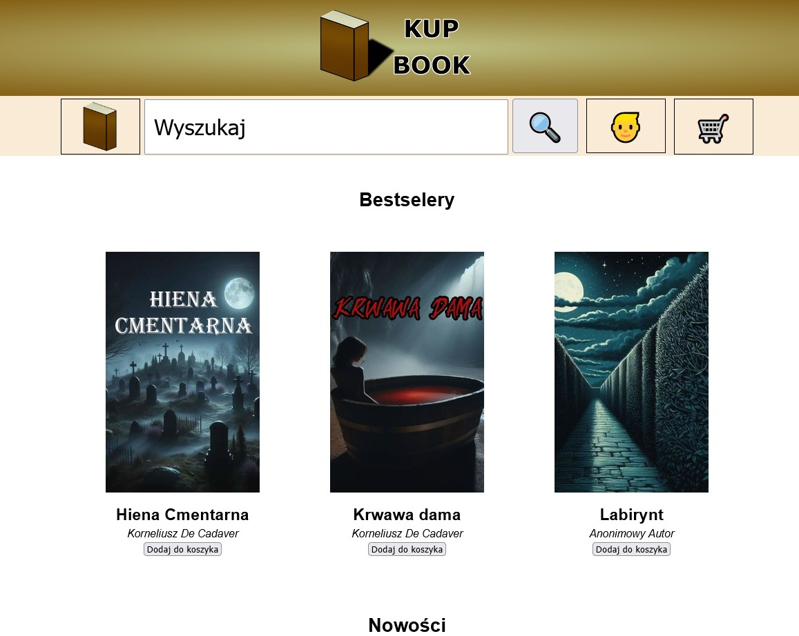
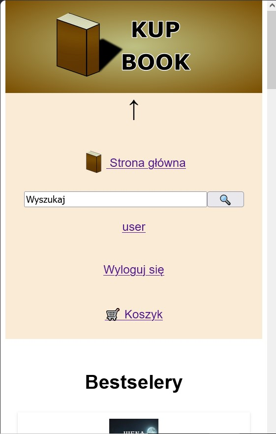
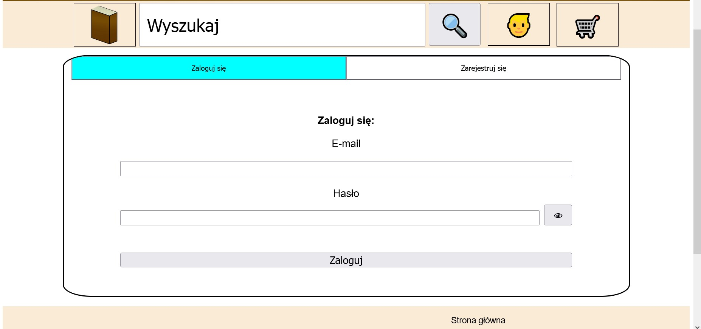
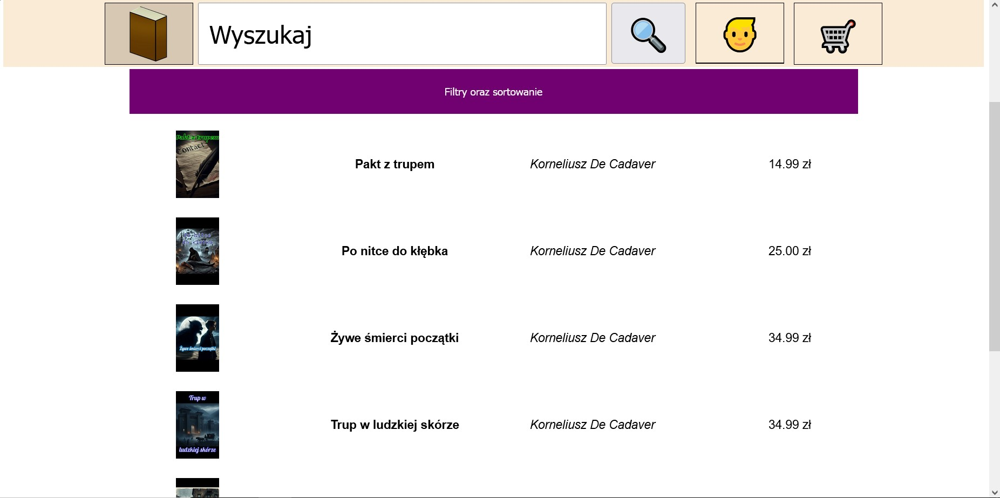
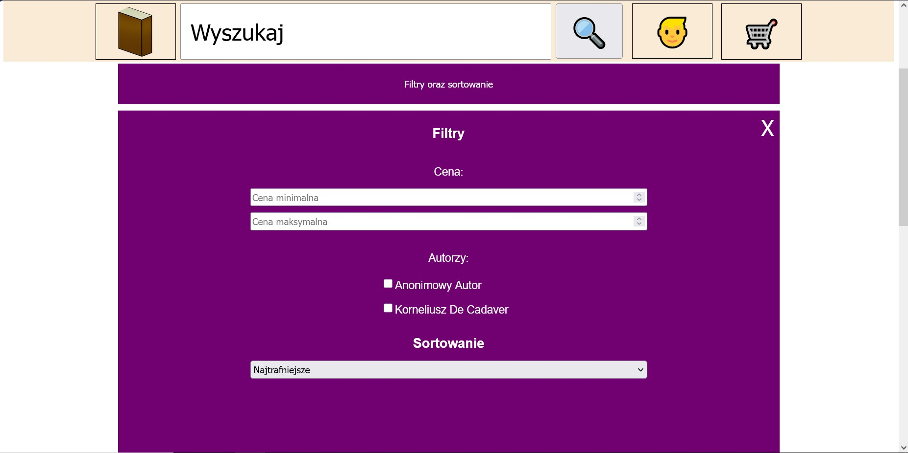
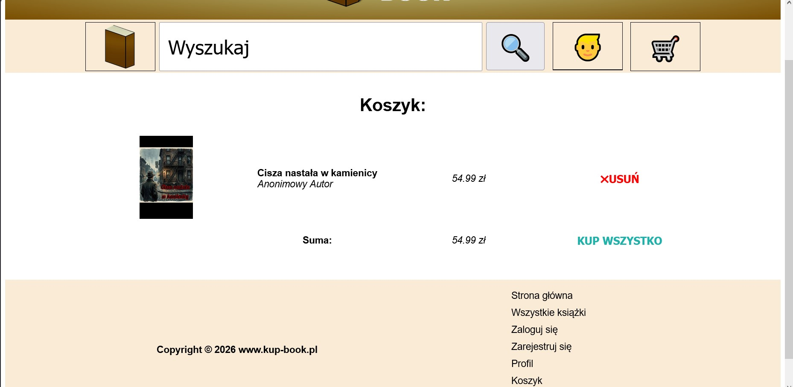
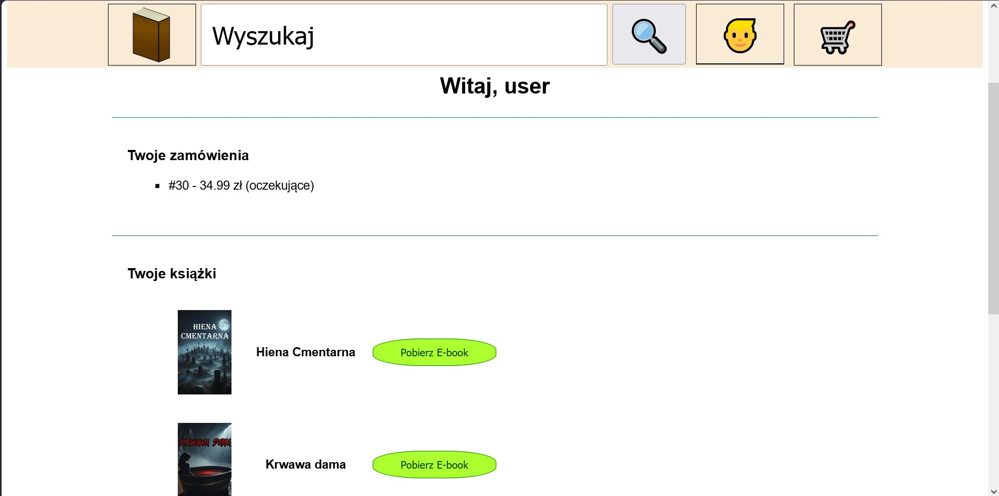
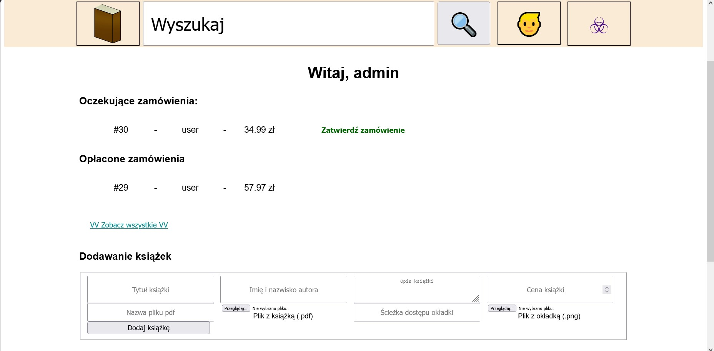

# Po polsku (in Polish)
# Projekt księgarni internetowej

## O projekcie
Jest to witryna internetowa księgarni, która umożliwia użytkownikowi przeglądanie, kupowanie oraz pobieranie e-booków.

Projekt ten imituje procesy sklepu internetowego, takie jak obsługa koszyka, tworzenie zamówień czy potwierdzanie płatności przez administratora.

    <summmary>Widok strony głównej

    

        
        
    

## Funkcje
### Użytkownik:
    - Opcje rejestracji oraz logowania
    - Przeglądanie posiadanych książek
    - Wyszukiwanie produktów po tytule oraz nazwie autora
    - Dodawanie produktów do koszyka
    - Składanie zamówień
    - Pobieranie kupionych e-booków (po potwierdzeniu przez administratora)
### System kupowania:
    - Dodawanie oraz usuwanie produktów z koszyka
    - Składanie zamówień
    - Generowanie unikalnego ID dla każdego zamówienia
### Panel administratora:
    - Widok na oczekujące zamówienia
    - Możliwość potwierdzenia płatności
    - Umożliwianie użytkowanikom pobrania e-booków
    - Dodawanie nowych produktów
    - Wgląd w zrealizowane zamówienia
### Wybierz sekcję poniżej, aby zobaczyć zrzuty ekranu z działania aplikacji

    
Ekran Logowania oraz Filtrowanie

     
    

        
        
        
    

    
Koszyk zakupowy oraz profil użytkownika

     
    

        
        
    

    
Panel administratora

     
    

        
    

## Wykorzystane technologie
    - HTML
    - CSS
    - JavaScript
    - PHP
    - MySQL
    - XAMPP

## Instrukcje techniczne
    1. Skopiuj repozytorium
    2. Przenieś projekt do folderu XAMPPa o nazwie 'htdocs'
    3. Zaimportuj bazę danych o nazwie 'kup_book'
    4. Skonfiguruj połączenie z bazą danych w pliku PHP
    5. Uruchom Apache oraz MySQL w XAMPPie
    6. Otwórz w przeglądarce folder bookshop na lokalnym serwerze (http://localhost/bookshop)

## Responsywność strony
    Aplikacja internetowa jest w pełni skoordynowana pod względem responsywności dla urządzeń mobilnych oraz desktopowych

## Notatki
    - Jest to wersja demo projektu (nie posiada prawdziwego systemu płatności)
    - Potwierdzenie płatności musi być dokonane ręcznie przez administratora
    - Ścieżki oraz połączenie z bazą danych mogą wymagać dostosowania do lokalnego środowiska
    - W celu wykorzystania tego projektu na konkretnej domenie należy wpierw przeczytać informacje w pliku DOMAIN.md

## Cel
### Głównym celem tego projektu była praktyka w zakresie:
    - Backendu (PHP)
    - Administracji bazy danych
    - Utworzenie gotowej strony internetowej

# In English
# Bookshop Web Application

## About the Project

    This is a web application of an online bookstore that allows users to browse, purchase, and download e-books.

    The project simulates a real-world shopping process, including cart management, order creation, and admin approval of payments.

    <summmary>View of the page

    

        
        
    

## Features
### User:
    - Register and login
    - Browse available books
    - Search books by title or author
    - Add books to cart
    - Place orders
    - Download purchased e-books (after admin approval)
### Shopping System:
    - Add/remove items from cart
    - Order summary
    - Generate order with unique ID
### Admin Panel:
    - View pending orders
    - Approve payments
    - Enable e-book downloads for users
    - Adding new products
    - View of completed order
### Choose section to see screenshots

    
Logging screen and Filtrs

     
    

        
        
        
    

    
Cart and profile

     
    

        
        
    

    
Admin panel

     
    

        
    

## Technologies
    - HTML
    - CSS
    - JavaScript
    - PHP
    - MySQL
    - XAMPP (local development)

## Installation 
    1. Clone the repository
    2. Move project to XAMPP htdocs folder
    3. Import database (SQL file)
    4. Configure database connection in PHP files
    5. Run Apache and MySQL in XAMPP
    6. Open in browser: http://localhost/bookshop

## Responsive design
    The application is fully responsive and works on mobile devices and desktop ones.

## Notes
    - This is a demo project (no real payments)
    - Payment confirmation is handled manually by admin
    - Paths and database connection may require adjustment depending on environment
    - Before using it on domain read a DOMAIN.md file

## Purpose
### The goal of this project was to practice:
    - backend logic (PHP)
    - database management
    - building a complete web application
